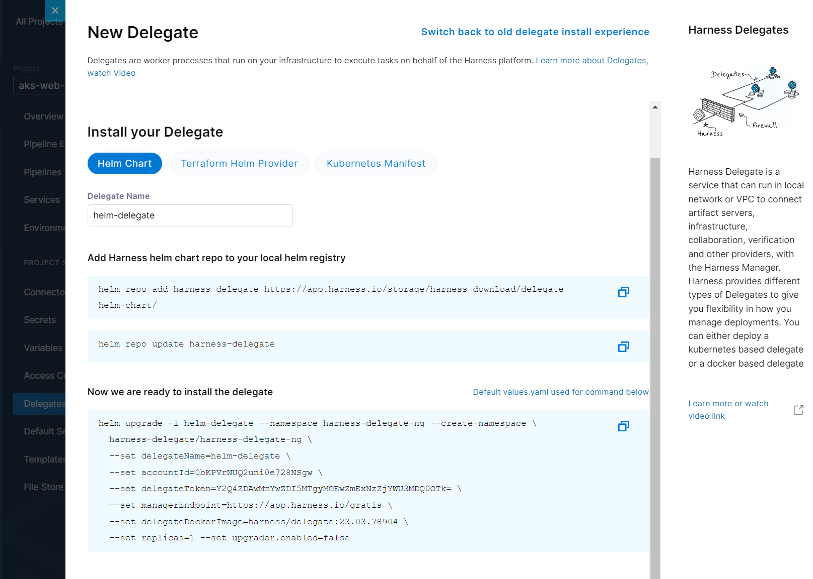
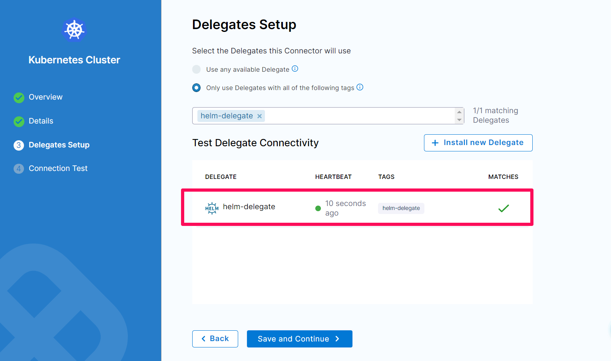
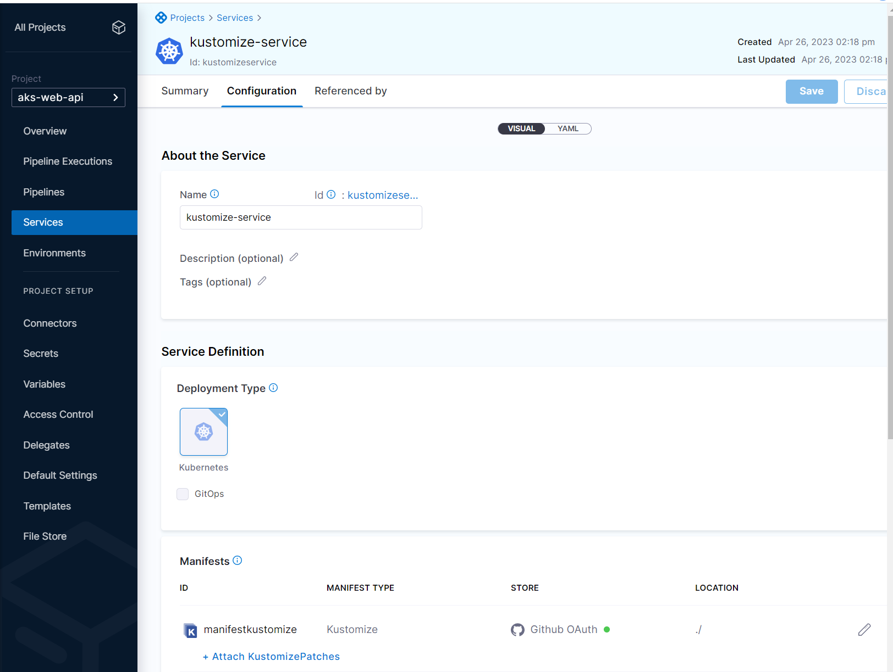
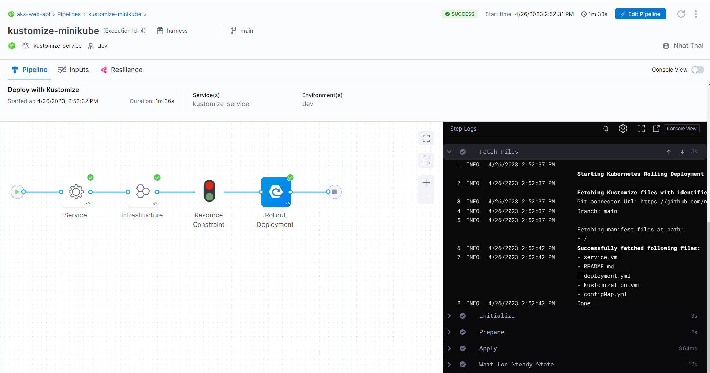
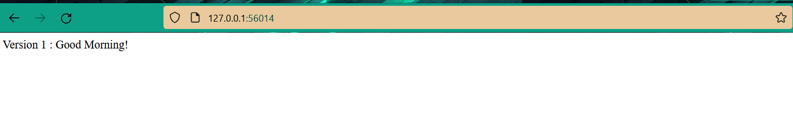

# Harness Kustomize
    Example: deploy web application using kustomize and harness

### Usage
+ Create Harness Account
+ Create a project
+ Create Environment

+ Start Minikube
    ```
    minikube start
    ```

+ Install Helm Delegate


+ Create Kubernetes Cluster


+ Create Service and GitHub Connection


+ Run Pipeline



### Result
+ Port Forwarding Service in Minikube
    ```
    minikube service the-service --url
    ```
+ Result
